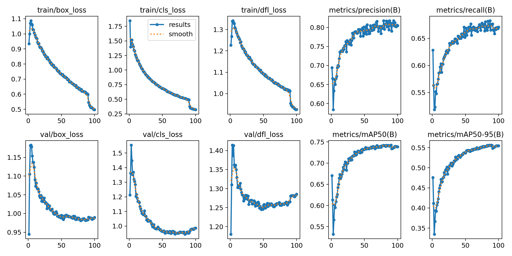
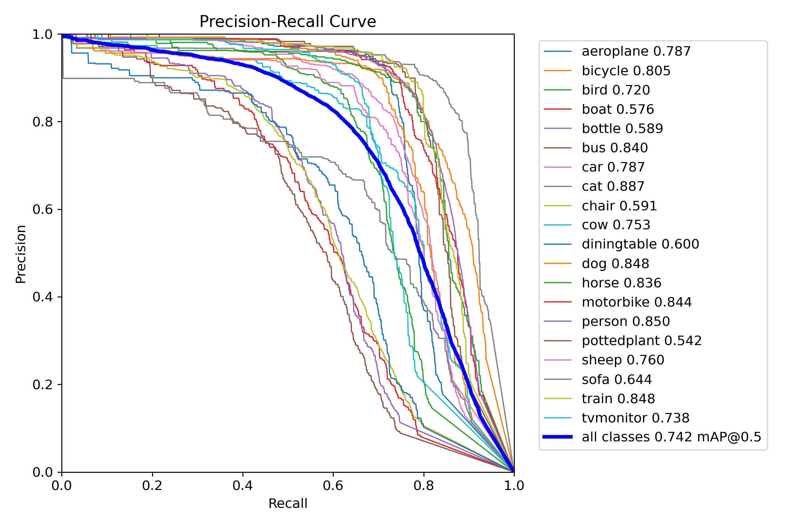
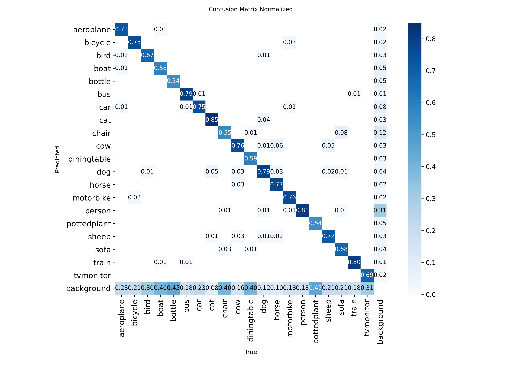

# YOLOv8 Object Detection & Multi-Object Tracking

<div align="center">


基于 YOLOv8s 在 PASCAL VOC2012 数据集上训练的目标检测与多目标追踪系统，提供 Streamlit 交互式 Demo，支持图片检测与视频实时追踪。

</div>

---

## ✨ 功能特性

- 🖼️ **图片目标检测**：上传图片，自动识别 20 类物体的位置、类别与置信度
- 🎬 **视频多目标追踪**：基于 ByteTrack 算法，对视频逐帧检测并分配唯一追踪 ID
- 🌐 **中英文界面切换**：侧边栏一键切换语言
- 📦 **ONNX 导出支持**：可导出为 ONNX 格式，脱离 PyTorch 环境部署推理

---

## 📊 实验结果

| Model | Epochs | mAP@0.5 | mAP@0.5:0.95 | 参数量 |
|-------|--------|---------|--------------|--------|
| YOLOv8n | 50 | 72.4% | 53.0% | 3.0M |
| **YOLOv8s** | **100** | **74.2%** | **55.6%** | **11.1M** |

---

## 🎬 Demo 效果

### 图片检测


### 视频多目标追踪（ByteTrack）

> 📹 [原始视频](assets/original_video.mp4) ｜ [追踪结果](assets/tracked_video.mp4)

使用 ByteTrack 算法对视频逐帧检测，为每个目标分配唯一 ID 并持续追踪。

---

## 📈 训练过程

### Loss & mAP 曲线



### PR 曲线



### 混淆矩阵



---

## 🗂️ 各类别检测结果

各类别 mAP@0.5（YOLOv8s，100 epoch）：

| 类别 | mAP@0.5 | 类别 | mAP@0.5 |
|------|---------|------|---------|
| person | 0.850 | cat | 0.887 |
| dog | 0.848 | horse | 0.836 |
| bus | 0.840 | train | 0.848 |
| motorbike | 0.844 | car | 0.787 |
| boat | 0.576 | bottle | 0.589 |
| pottedplant | 0.542 | chair | 0.591 |

大目标（人、动物、车辆）检测效果好，小目标（船、花盆）相对较差，符合感受野与目标尺寸的理论预期。

---

## 🛠️ 技术栈

- **模型**：Ultralytics YOLOv8s（anchor-free，FPN多尺度检测头）
- **追踪**：ByteTrack 多目标追踪算法
- **框架**：Python 3.8 / PyTorch 2.0
- **Demo**：Streamlit（支持中英文切换）
- **数据集**：PASCAL VOC2012（20类，5717张训练图 / 5823张验证图）
- **部署**：支持导出 ONNX 格式，可在不依赖 PyTorch 的环境下推理

---

## 🚀 快速开始

### 1. 安装依赖

```bash
pip install ultralytics streamlit
```

### 2. 数据准备

下载 [VOC2012 数据集](http://host.robots.ox.ac.uk/pascal/VOC/voc2012/)，运行格式转换：

```bash
python voc2yolo.py
```

### 3. 训练模型

```bash
python train.py
```

### 4. 启动 Demo

```bash
streamlit run app.py
```

在侧边栏填入模型路径，上传图片或视频即可。

### 5. 导出 ONNX

```python
from ultralytics import YOLO
model = YOLO('best.pt')
model.export(format='onnx')
```

---

## 📁 项目结构

```
├── app.py              # Streamlit Demo（图片检测 + 视频追踪）
├── train.py            # 训练脚本
├── voc2yolo.py         # VOC XML 转 YOLO txt 格式
├── VOC2012.yaml        # 数据集配置
├── .gitignore
└── assets/
    ├── demo.png                        # 图片检测截图
    ├── original_video.mp4              # 原始演示视频
    ├── tracked_video.mp4               # 追踪结果视频
    ├── results.png                     # 训练曲线
    ├── BoxPR_curve.png                 # PR 曲线
    └── confusion_matrix_normalized.png # 混淆矩阵
```
